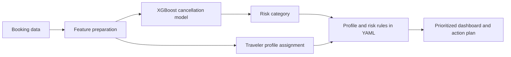
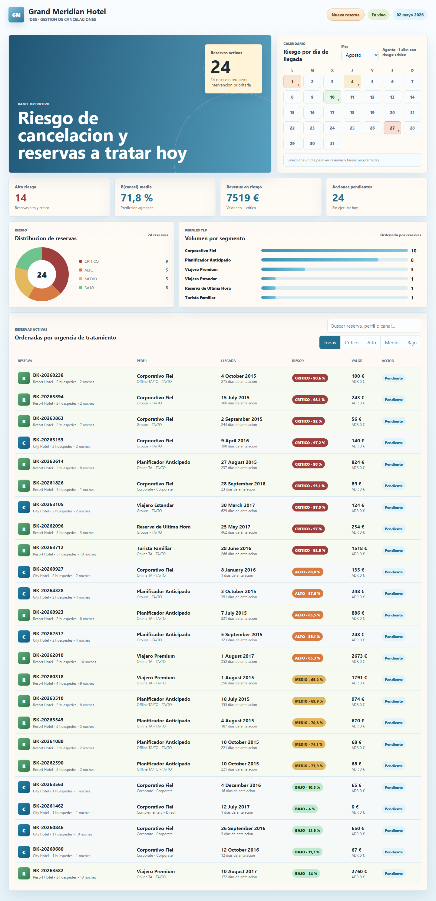
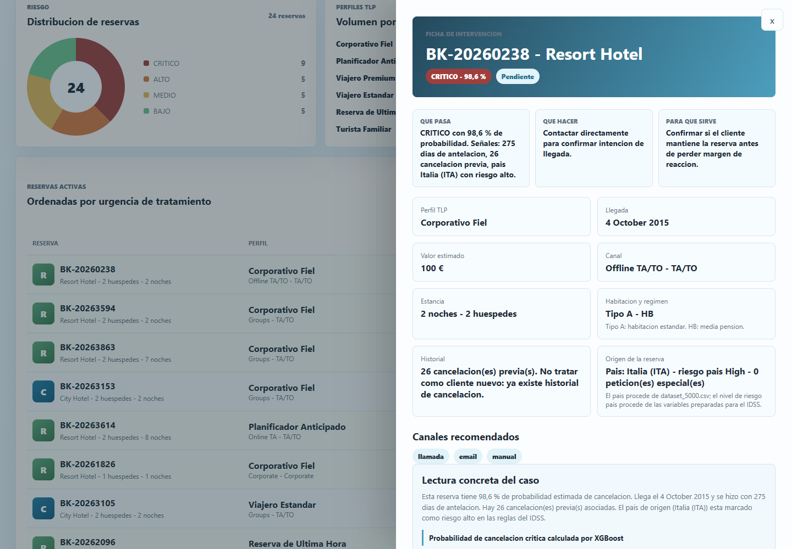

# Hotel Cancellation Risk & Decision Support

**An intelligent decision support prototype that turns booking data into cancellation risk estimates, traveler profiles and prioritized hotel operations.**

University team project at the Universitat Politècnica de Catalunya (UPC). The system combines supervised learning, customer segmentation and expert rules in an interactive dashboard. Its purpose is to help a hotel identify bookings that may need attention and choose an appropriate follow-up strategy.

## From prediction to an operational decision

A booking receives a cancellation probability, one of six traveler profiles, a risk level and a suggested action plan. The dashboard presents booking details, profile descriptions, contact channels and timing, along with a priority score for reviewing the queue. A new-booking simulator lets the user explore the model and the recommendations.

The result is a working decision-support prototype and a recorded comparison of four machine-learning models. It does not establish that the recommended actions reduce cancellations or improve hotel revenue in production.



## Implementation

### Prediction

The model estimates `P(cancellation)` from **65 transformed features**. The recorded search compares Random Forest, Extra Trees, Histogram Gradient Boosting and XGBoost using three-fold cross-validation, with six search iterations per model. XGBoost has the highest recorded cross-validation F1 score, approximately **0.7532**.

The selected configuration uses 200 trees, maximum depth 5, learning rate 0.03, row subsampling 0.8 and column subsampling 0.85. The summary records 3,784 development rows and 946 test rows.

### Traveler profiles

The interface exposes six operational profiles: advance planners, last-minute travelers, premium travelers, families, standard travelers and loyal corporate travelers. For new bookings, `idss_engine.py` standardizes clustering features and assigns the nearest reference centroid. Existing records can retain their stored cluster assignment.

Profile descriptions connect the statistical grouping with an operational interpretation. They are segmentation summaries, rather than individual explanations of the cancellation classifier.

### Expert recommendations

Risk thresholds and profile-specific action sets come from `reglas_negocio_idss_experto.yaml`. The current engine selects the **base action set for the profile and risk level**, including channels, timing and priority. The review queue also considers estimated risk, booking value, lead time and cancellation history.

The published configuration defines base recommendations for six profiles and four risk levels. The engine selects those profile/risk actions; it does not implement additional contextual or global policies. `deposit_type` is retained as operational data and excluded from the supervised feature matrix; deposit-sensitive recommendations are not implemented.

### Browser interface

The HTML/CSS/JavaScript dashboard reads precomputed `dashboard_data.js`. The Python export includes model trees and preprocessing statistics, allowing the browser to evaluate a new booking locally. Regenerating that export uses the stored model, reference datasets and expert-rule configuration.

An optional local email agent exists in the repository. It is an additional integration, not a requirement for inspecting the dashboard or the portfolio demonstration.

## Recorded evaluation

The following values are taken from `Interficie/model_artifacts/best_model_summary.json`. Training and evaluation were **not rerun** during portfolio preparation.

| Model | Test F1 | Test ROC AUC |
|---|---:|---:|
| Random Forest | 0.7754 | 0.9204 |
| Extra Trees | 0.7682 | 0.9159 |
| Histogram Gradient Boosting | 0.7635 | 0.9224 |
| **XGBoost** | **0.7906** | **0.9241** |

The selected model records test accuracy **0.8404**, precision **0.7383** and recall **0.8507**. These figures describe the stored split and evaluation setup; they are not evidence of calibration, external generalization or business impact.

The artifact summary also records aggregate SHAP feature importance, with country-risk categories, lead time and the Online TA market segment among the prominent features. The operational interface does **not** provide local SHAP explanations. Its displayed reasons summarize risk and traveler profile, and do not identify causal drivers for an individual prediction.

## Explore the dashboard






Open `Interficie/index.html` in a modern browser to inspect the included precomputed demonstration. Python is needed when regenerating the data export.

From the repository root:

```bash
python -m venv .venv
source .venv/bin/activate
python -m pip install -r Interficie/requirements.txt
python Interficie/generate_dashboard_data.py
```

On Windows, activate the environment with `.venv\Scripts\activate` instead. Then reopen the dashboard. The dependency file contains pandas, NumPy, scikit-learn, XGBoost, joblib and PyYAML; its versions are not pinned, so compatibility with the serialized model should be checked in the selected environment.

## Repository guide

| Path | Purpose |
|---|---|
| `Interficie/index.html`, `styles.css`, `app.js` | Dashboard and new-booking interaction |
| `Interficie/idss_engine.py` | Feature preparation, prediction, profiling and decisions |
| `Interficie/generate_dashboard_data.py` | Browser-data export |
| `Interficie/dashboard_data.js` | Precomputed demonstration and inference configuration |
| `Interficie/model_artifacts/` | Serialized model and recorded evaluation summary |
| `Interficie/reglas_negocio_idss_experto.yaml` | Risk thresholds and expert recommendations |
| `Interficie/hotel_clustering_output.csv` | Reference records and traveler clusters |
| `Interficie/dataset_5000.csv` | Reference booking extract |
| `Interficie/tests/` | Existing engine regression tests |
| `Interficie/email_agent/` | Optional communication integration |

This public edition packages the operational interface, its model, reference data and supporting code. The source academic repository contains the wider analysis and delivery material. `Interficie/` is the main entry point for this edition.

## Validation and next steps

Six existing regression tests passed during portfolio preparation: two checks of cluster/risk action selection and four checks of deterministic prediction and inference-feature handling. The saved XGBoost model also loaded successfully and the full Python decision engine enriched ten reference bookings with valid probabilities, profiles and recommendations.

Reproduce the engine tests from the repository root:

```bash
python -m unittest discover -s Interficie/tests -p 'test_cluster_rule_generation.py' -v
python -m unittest discover -s Interficie/tests -p 'test_reproducibility.py' -v
```

The checks used Python 3.12.14, scikit-learn 1.9.1 and XGBoost 3.4.1. Loading the archived model emitted an older-version serialization warning; inference succeeded in this environment. Dependencies are not pinned. Training, email integration tests and browser automation were not rerun, and no emails were sent.

The included booking extracts contain no names, email addresses or contact details. Numeric agent/company identifiers remain. Their precise upstream provenance and redistribution license are not established by this edition; no new dataset license is claimed.

Further work should package preprocessing with the trained model, pin dependency versions, test richer contextual rules, and evaluate calibration and operational outcomes on an independent dataset.

## Academic context and attribution

This is a UPC university team project derived from [K4NG14/IDSS_Hotels](https://github.com/K4NG14/IDSS_Hotels). This is an operational snapshot of the team project, with source attribution retained. The original repository and its history remain separate from this public edition. No additional redistribution license is granted by this README.
